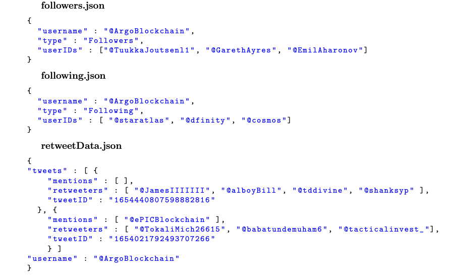

# Twitter Analysis with PageRank Algorithm

## 1. Introduction
This project, **Twitter Analysis with PageRank Algorithm**, is built using Object-Oriented Programming (OOP) principles. The system leverages **Selenium** and the **Twitter API** to collect data on Key Opinion Leaders (KOLs) on Twitter, stores the data in a PostgreSQL database, and applies the **PageRank Algorithm** to analyze the influence of nodes within the graph.

### Key Components
1. **Data Collection**: Managed by the `scraper` package.
2. **Data Processing**: Import data from the `output` directory into the database and compute PageRank via the `processor` package.
3. **Results**: PageRank scores are exported to the `target` directory.

---

## 2. Usage

### 2.1. Environment Setup
- Ensure **Java**, **PostgreSQL**, and **Selenium WebDriver** are installed on your system.
- Clone the repository:
```bash
git clone https://github.com/username/TwitterAnalysis-with-Pagerank.git
cd TwitterAnalysis-with-Pagerank
```
- Create an `application.properties` file in the root directory of the project with the following structure:
```bash
spring.datasource.url=jdbc:postgresql://localhost:5432/DatabaseName
spring.datasource.username=YourDatabaseUsername
spring.datasource.password=YourDatabasePassword

initialize_databasePath=src/main/java/processor/dataprocessing/sql/schema.sql
queriesPath=src/main/java/processor/dataprocessing/sql/queries.sql
directedSimpleGraphAdjListPath=output/AdjList/directedSimpleGraph.json
1-wayDirectedSimpleGraphAdjListPath=output/AdjList/1-wayDirectedSimpleGraph.json
PageRankOutputPath=output/PageRankPoints/pageRankPoints.json
IncrementalPageRankOutputPath=output/PageRankPoints/IncrementalPageRankPoints.json

twitter.username=YourTwitterUsername
twitter.password=YourTwitterPassword

oauth.ConsumerKey=YourConsumerKey
oauth.Consumer_Key_Secret=YourConsumerKeySecret
oauth.Access_Token=YourAccessToken
oauth.Access_Token_Secret=YourAccessTokenSecret
```
### 2.2. Data Collection
1. Navigate to the `scraper` directory:
```bash
cd src/main/java/scraper
```
2. Run the `Main.java` file to start data collection:
```bash
javac Main.java
java Main
```
3. The collected data will be saved in the `output` directory:
- Graph adjacency lists: Located in `output/AdjList`.
- Raw data: Located in `output/Data`.

### 2.3. Data Processing and PageRank Calculation
1. Navigate to the `processor` directory:
```bash
cd src/main/java/processor
```
2. Run the `Main.java` file to process data and calculate PageRank:
```bash
javac Main.java
java Main
```
3. The `Main.java` file performs the following tasks:
- Initializes the database using `schema.sql`.
- Imports data from the `output` directory into the PostgreSQL database.
- Computes PageRank scores and exports the results to `output/PageRankPoints`.

### 2.4. Results
- PageRank scores of graph nodes are saved in the `output/PageRankPoints` directory:
- `pageRankPoints.json`: General PageRank results.
- `IncrementalPageRankPoints.json`: Incremental PageRank results.
---

## 3. Report
Detailed package design and the overall process are documented in the report file located in `report/OOP_Report.pdf`.

---

## 4. Technologies Used
- **Programming Language**: Java
- **Framework**: Spring Boot
- **Library**: Selenium WebDriver
- **Database**: PostgreSQL
- **Algorithm**: PageRank

---

## 5. Contributing
If you’d like to contribute to this project:
1. Fork the repository.
2. Create a feature branch:
```bash
git checkout -b feature-branch
```
3. Commit your changes:
```bash
git commit -m “Add new feature”
```
4. Push the branch:
```bash
git push origin feature-branch
```
5. Open a Pull Request.

---
For any additional queries, feel free to open an issue in the repository. 😊